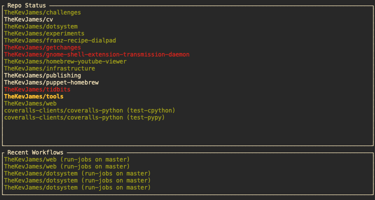

cctui
=====

CCTUI is a CCTray implementation for your terminal -- a live-updating dashboard
of any of your repos. In addition to supporting the standard CCTray protocol,
it additionally can support CircleCI's new Pipelines feature.

It can also (optionally) display your Github notifications!

You Named It What?
------------------

Yeah, I know. Naming things is hard! I'd be happy to accept ideas :)

CircleCI's New Pipelines Feature?
---------------------------------

Unfortunately, CircleCI's workflows/pipelines feature doesn't work nicely with
the CCTray standard and returns the build status of *whichever job happened to
run last* instead of the entire workflow. This project stemmed out of wishing
CCMenu had a terminal UI and worked with CircleCI's workflows. Done and done!

Usage
-----

.. code-block:: console

    $ cargo run --release

Use ``j``/``k`` to scroll, ``g``/``G`` for navigating to the top/bottom,
``<enter>`` to open your browser to the selected repo, and ``q`` to quit. You
can force a refresh of all repos with ``r``. Use ``<tab>`` to toggle between
which tab those keys are acting upon.

Configuration
-------------

This tool doesn't really make any sense with a default configuration, so you'll
need to edit ``~/.config/cctui/config.yml``:

.. code-block:: yaml

    notifs:
    - service: Github
      token: qwerasdfzxcv12345678910

    repos:
    - name: TheKevJames/tools
      circleci:
        branch: cctui-dev
        token: qwer1234asdf5678zxcv
        workflow: run-jobs
    - name: TheKevJames/gnome-shell-extension-transmission-daemon
      circleci:
        token: 1234asdf5678zxcv9101
        workflow: integration-tests
      refresh: 120
    - name: coveralls-clients/coveralls-python
      cctray:
        url: https://circleci.com/cc.xml?circle-token=asdf5678zxcv9101tyui

Basically, ``repos`` accepts a list of items with the following schema:

+-----------------------+--------------------------------------+------------+
| field                 | decription                           | default?   |
+=======================+======================================+============+
| ``name``              | ``<username>/<repo>``                |            |
+-----------------------+--------------------------------------+------------+
| ``refresh``           | refresh interval between updates     | ``30``     |
+-----------------------+--------------------------------------+------------+

And **one of** the following integration configs:

+-----------------------+--------------------------------------+------------+
| field                 | decription                           | default?   |
+=======================+======================================+============+
| ``cctray.url``        | url of CCTray config (with token)    |            |
+-----------------------+--------------------------------------+------------+
| ``circleci.branch``   | name of branch to be tracked         | ``master`` |
+-----------------------+--------------------------------------+------------+
| ``circleci.token``    | personal access token                |            |
+-----------------------+--------------------------------------+------------+
| ``circleci.vcs``      | VCS slug for your repo ("gh", "bb")  | ``gh``     |
+-----------------------+--------------------------------------+------------+
| ``circleci.workflow`` | name of CircleCI workflow to monitor |            |
+-----------------------+--------------------------------------+------------+

``notifs`` accepts a list of items with the following schema:

+-----------------------+--------------------------------------+------------+
| field                 | decription                           | default?   |
+=======================+======================================+============+
| ``service``           | must be ``Github``, for now (sorry!) |            |
+-----------------------+--------------------------------------+------------+
| ``refresh``           | refresh interval between updates     | ``30``     |
+-----------------------+--------------------------------------+------------+
